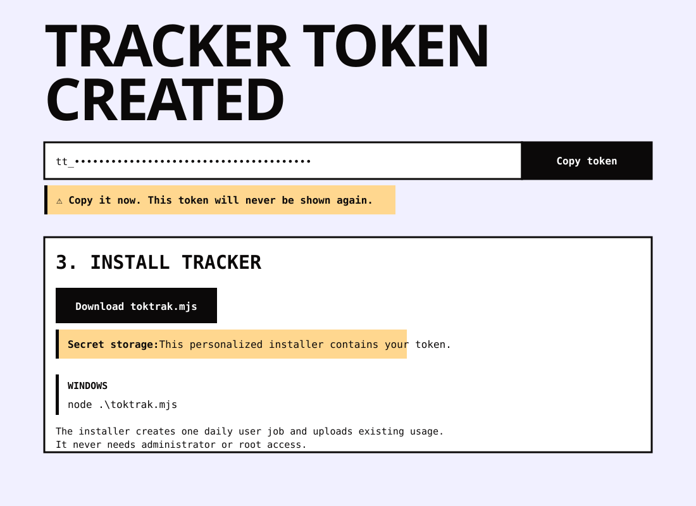

## Symptom

The installer-storage explanation sits above the token instead of beside the
installer download. The token itself lacks an explicit one-time-display warning.

## Impact

Users may miss that the visible token cannot be recovered and may not understand
why downloading the personalized installer preserves it.

## Evidence

After creating a tracker token, `/tokens` shows one warning combining both
messages before the token and away from the installer download.

## Expected

Place an explicit “never shown again” warning beside the token. Place the
installer-storage explanation beside the download action.

## Accepted mockup

## Resolution

The one-time-display warning now sits directly below the token. The personalized
installer explanation now sits directly below its download action.
