# Operations

TokTrak serves plain HTTP behind a reverse proxy. This document states the
TokTrak runtime contract and recommends one deployment shape. Site operators own
TLS, compression, authentication secrets, persistent-volume backups, monitoring,
and rollback policy.



## Requirements

- Rootless Podman on Linux, macOS, or Windows.
- Node.js for the shown secret-generation command.
- Credentials for the configured OCI image repository.
- A reverse proxy with public TLS.
- A durable volume writable by mapped container root and covered by the
  operator's backup policy.

The image runs as container UID `0`; rootless user-namespace mapping keeps that
user unprivileged on the host.

## Image repository

Configure the release checkout locally:

```toml
# mise.local.toml
[env]
TOKTRAK_IMAGE_REPOSITORY = "registry.example.com/team/toktrak"
```

This ignored file selects where image and release tasks tag and push images.

## Configuration

Store production values in an owner-readable env file:

```sh
TOKTRAK_BASE_URL=https://toktrak.isp-insoft.de
TOKTRAK_PORT=8080
TOKTRAK_DATA_DIR=/data
TOKTRAK_OIDC_DISCOVERY_URL=https://accounts.google.com/.well-known/openid-configuration
TOKTRAK_OIDC_CLIENT_ID=...
TOKTRAK_OIDC_CLIENT_SECRET=...
TOKTRAK_ALLOWED_DOMAIN=isp-insoft.de
TOKTRAK_SESSION_SECRET=...
TOKTRAK_TOKEN_PEPPER=...
```

Generate the two Base64 secrets separately:

```sh
node -e "console.log(require('node:crypto').randomBytes(32).toString('base64'))"
```

`TOKTRAK_BASE_URL` is the public external URL used for redirects and tracker
downloads; production accepts HTTPS, plus local HTTP for verification only.
`TOKTRAK_SESSION_SECRET` signs login cookies. `TOKTRAK_TOKEN_PEPPER` hashes
tracker tokens and must remain stable; changing it invalidates every tracker
token. Never set `TOKTRAK_DEV_AUTH` in production.

## Deploy

A simple recommended deployment uses an immutable `vN` image tag:

```sh
podman volume create toktrak-data
podman run -d --name toktrak --replace --restart=always \
  --env-file=$HOME/.config/toktrak/server.env \
  --volume=toktrak-data:/data \
  --publish=127.0.0.1:8080:8080 \
  registry.example.com/team/toktrak:v0
```

Proxy public HTTPS to host loopback port `8080`. Do not expose the container
port publicly.

## Recommended backup and recovery posture

TokTrak cannot own or verify production backup policy. A safe operator procedure
should stop TokTrak, back up the complete data volume, restart it, and test
restoration regularly. Keep the env file and stable token pepper in the
protected deployment secret store, separate from volume backups.

Before upgrades, operators should pull the next immutable tag, stop TokTrak,
back up the volume, and replace the container with the new tag. Rollback policy
should restore the matching data backup and run the previous image tag.

## Diagnostics

The linked runtime includes JMX, JFR, `jcmd`, and `jfr`. Remote management is
disabled by default.

For a short diagnostic run, add one line to the protected env file and publish
the same fixed port on host loopback:

```sh
JDK_JAVA_OPTIONS=-Dcom.sun.management.jmxremote -Dcom.sun.management.jmxremote.port=9010 -Dcom.sun.management.jmxremote.rmi.port=9010 -Djava.rmi.server.hostname=127.0.0.1 -Dcom.sun.management.jmxremote.authenticate=false -Dcom.sun.management.jmxremote.ssl=false
podman run ... --publish=127.0.0.1:9010:9010 ...
```

Connect VisualVM or JMC to
`service:jmx:rmi:///jndi/rmi://127.0.0.1:9010/jmxrmi`. For a remote host, keep
Podman bound to loopback and tunnel with `ssh -L 9010:127.0.0.1:9010 HOST`.

Unauthenticated JMX permits code execution. Never publish it beyond loopback;
remove the options immediately after diagnosis.

Shell-free diagnostics:

```sh
podman exec toktrak /opt/toktrak/bin/jcmd 1 VM.version
podman exec toktrak /opt/toktrak/bin/jcmd 1 JFR.start name=toktrak settings=profile duration=60s filename=/data/toktrak.jfr
podman cp toktrak:/data/toktrak.jfr .
```

## Release

Versions are consecutive integers with matching Git and image tags: `v0`, `v1`,
and so on. Add the exact next `## vN` section to `CHANGELOG.md`, then use a
clean `trunk` synchronized with `origin/trunk`:

```sh
mise run release --dry-run
mise run release
```

The dry run performs local verification, runtime/image builds, and a rootless
restart/persistence check without tags or remote writes. A release pushes only
`$TOKTRAK_IMAGE_REPOSITORY:vN` and the matching Git tag; no `latest` tag exists.

If image or Git-tag push fails, retain the local candidate tag and image, fix
authentication or networking, and rerun `mise run release`. Release recovery
republishes that exact candidate. If either local artifact was removed, inspect
registry and Git state before retrying.
