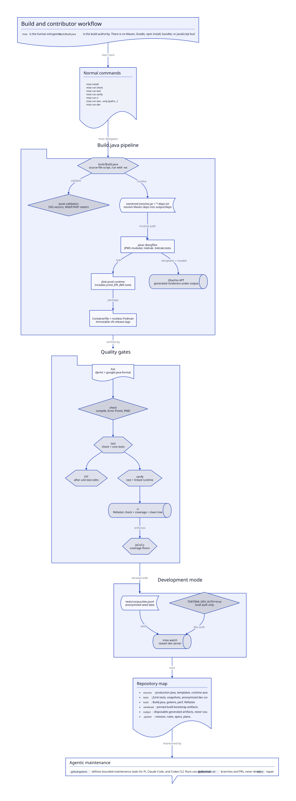

# TokTrak

[![TokTrak — Internal Coding Harness Token Tracker][toktrak-logo]][toktrak]

[toktrak-logo]: sources/toktrak/assets/public/logo-lockup-dark.svg
[toktrak]: https://toktrak.isp-insoft.de

## Why

AI coding subscriptions hide effective consumption behind subsidized flat
pricing. TokTrak gives teams useful projected-cost visibility without pretending
to provide complete billing data or monitoring work content.

TokTrak observes only local coding-harness usage reported by `ccusage`. Cloud,
web, and CI usage are outside its view.

## What

TokTrak is one small web service and one workstation tracker.

The Java 26+ service authenticates company users through OAuth SSO, issues
personal tracker tokens, and presents team totals, averages, leaderboards,
trends, and USD/EUR estimates through a live server-rendered dashboard.

The tracker is one plain Node `.mjs` using the standard library, a pinned
`ccusage`, and the native user scheduler:

| OS      | Scheduler        |
| ------- | ---------------- |
| Windows | `schtasks`       |
| macOS   | LaunchAgent      |
| Linux   | `systemd --user` |

It installs without root or administrator access and uploads daily.

## System overview

Start with the bird's-eye map, then follow the three detail diagrams in order.
The D2 sources live beside the rendered SVGs under `.system`.



### 1. Tracker upload flow

The tracker is intentionally not a Java application. It is one personalized Node
`.mjs` file that installs into the user's account, runs native scheduling,
invokes pinned `ccusage`, uploads bounded JSON, and self-updates only after a
SHA-256 check.



### 2. Runtime

The server is a small Java 26+ JPMS service. It stays stateless except for
`TOKTRAK_DATA_DIR`, writes durable NDJSON through one bounded writer, and
rebuilds the in-memory projection during startup.



### 3. Build and contributor workflow

`mise` is the human entrypoint, but `tools/Build.java` is the build authority.
There is no Maven, Gradle, Spring, servlet container, npm install, bundler, or
DB server.

Run `mise run check`, `mise run test`, `mise run verify`, then `mise run ci` for
progressively stronger guarantees. Use `mise run test --only <paths...>` for
focused iteration without the full ladder. Every pull request, including
Renovate and Golem updates, runs core CI. Changed paths select native tracker
integration on Linux, macOS, and Windows, production container verification,
performance benchmarks, and fresh PIT mutation tests when relevant. Unknown
paths or shared toolchain changes select every check. The required `ci` result
reports each selection and rejects failed or unexpectedly skipped work.
Successful PRs keep results in logs and job summaries without report artifacts.
Performance reports are observational; they do not enforce a slowdown threshold.



## Contribute

See [CONTRIBUTING.md](CONTRIBUTING.md) for platform requirements, repository
layout, generated-code boundaries, and verification commands.

## Install the tracker

1. Install Node.js 22 or newer.
2. Sign in at <https://toktrak.isp-insoft.de>.
3. Create a tracker token.
4. Download `toktrak.mjs` and run it with Node from the download location.

The installer creates a user-scoped daily scheduler without administrator or
root access. It contains the one-time token; do not share it. If it is lost,
revoke it and create another.

## Maintain with golems

Local golems run one bounded maintenance task through Pi, Claude Code, or Codex
CLI. Task definitions live in `.golems/`; `_golems.md` supplies shared
instructions. Each task explicitly declares its harness, model, thinking level,
and weekday. `mise run check` validates their strict structure offline.

Mise installs pinned CLI versions for the golem tasks. Authenticate each harness
with its provider subscription:

- Pi and Codex CLI use ChatGPT Pro authentication. Pi models must use the
  `openai-codex/` provider; metered API fallback is forbidden.
- Claude Code uses Claude subscription authentication, not a metered API key.
- `gh` uses an account authorized for this repository.

Then validate definitions through the base gate, probe one authenticated task
per configured harness, and run one task:

```sh
mise run check
mise run golem-auth-check
mise run golem bugs
```

A run uses the exact branch `golem/<task-id>`. It resumes one matching open pull
request or removes a stale dedicated branch before fresh work. No useful change
creates no remote state. Useful work is committed, checked for protected paths,
published with guarded branch updates, and labeled. CI runs independently;
Golems inspect failures and review comments when they next run, while merging
remains manual. Harness sessions are always ephemeral.

Run from the clean, current default branch. On failure, inspect the printed
error, the ignored `output/golems/<task-id>` worktree, its dedicated remote
branch, and any open pull request. Resolve concurrent branch changes or review
threads, then rerun the same task. Never repair failure by pushing `trunk`,
merging the pull request, or editing `.system`, `.github/golems`, `.claude`,
`.agents`, `.codex`, or `.pi` from a golem branch.

Optional public review evidence uses only the seeded development corpus. The
harness may place small safe diagrams, screenshots, or videos under
`output/golem-evidence` and reference them in pull-request prose as
`[evidence:<filename>]`; the parent uploads them after the harness exits.

To change or add a task, edit one lowercase kebab-case `.md` file, then run
`mise run check` for offline validation. `golem-auth-check` probes live harness
credentials separately. Tracked `.claude/skills` are canonical; Pi points to
them through `.pi/settings.json`, Claude discovers them directly, and Codex
follows the tracked `.agents/skills` bridge.

### Golem CI

`.github/workflows/golem.yml` dispatches due tasks daily at `09:17 UTC` and
serializes every scheduled, manual, and reseed run. It installs the selected
pinned harness on GitHub-hosted Ubuntu, validates runner `gh >= 2.70.0`, and
delegates the full lifecycle to `tools/golem.mjs`. Each task job stops after 45
minutes.

Install a repository-scoped GitHub App with write access to contents and pull
requests, read access to actions, checks, commit statuses, and issues, and no
workflow permission. Store its client ID as the `TOKTRAK_AGENT_APP_CLIENT_ID`
repository variable and its private key as the `TOKTRAK_AGENT_APP_PRIVATE_KEY`
repository secret. The workflow mints a short-lived token and derives the bot
Git identity.

Create the AES-256 cache key once:

```sh
node -e 'process.stdout.write(require("node:crypto").randomBytes(32).toString("base64"))' | gh secret set GOLEM_AUTH_CACHE_KEY
```

Pi and Codex use separate encrypted rotating caches.

Pi must be seeded from a dedicated one-use profile. OpenAI refresh tokens are
single-use, so copying the normal Pi auth file creates two competing instances.
Whichever instance refreshes first invalidates the other copy.

Create an empty profile and authenticate its OpenAI Codex provider:

```nushell
let profile = "/path/to/empty/golem-pi-profile"
mkdir $profile
with-env { PI_CODING_AGENT_DIR: $profile } { cd $profile; pi }
```

Inside Pi, run `/login`, choose OpenAI Codex, then run `/quit`. Seed the
workflow from that profile:

```nushell
open --raw ($profile | path join auth.json)
| encode base64
| gh secret set GOLEM_PI_AUTH_SEED

gh workflow run golem.yml --ref trunk -f operation=reseed-pi -f task=bugs
```

After the reseed workflow succeeds, delete the bootstrap secret and dedicated
profile. Never launch Pi with that profile again:

```nushell
gh secret delete GOLEM_PI_AUTH_SEED
rm --recursive $profile
```

Seed Codex from a trusted authenticated machine, confirm success, then delete
the bootstrap secret:

```sh
node -e 'process.stdout.write(require("node:fs").readFileSync(require("node:path").join(require("node:os").homedir(), ".codex/auth.json")).toString("base64"))' | gh secret set GOLEM_CODEX_AUTH_SEED
gh workflow run golem.yml --ref trunk -f operation=reseed-codex -f task=bugs
gh secret delete GOLEM_CODEX_AUTH_SEED
```

Generate Claude's one-year subscription token with `claude setup-token`, then
store it as `GOLEM_CLAUDE_OAUTH_TOKEN`. Renew it before expiry. Metered API keys
are neither required nor permitted.

Gatebridge evidence is optional. To enable it, store
`GATEBRIDGE_R2_ACCESS_KEY_ID`, `GATEBRIDGE_R2_SECRET_ACCESS_KEY`, and
`GATEBRIDGE_R2_ENDPOINT`. These credentials enter only the parent lifecycle; the
harness environment removes them.

Run an explicit task only from `trunk`:

```sh
gh workflow run golem.yml --ref trunk -f operation=run -f task=bugs
```

Use the job summary for selection, effective parameters, tool version, result,
and run URL. A missing, stale, revoked, or corrupt Pi or Codex cache fails
closed; create a fresh seed and dispatch the matching reseed operation. A Claude
renewal error requires a new setup token. For branch, protected-path, review, or
check failures, inspect the dedicated branch and pull request, repair the
violation as a human, then rerun the same task. Never bypass the lifecycle by
pushing `trunk` or merging the pull request.

## Operate

See [OPERATIONS.md](OPERATIONS.md) for production configuration, rootless Podman
deployment, backups, diagnostics, upgrades, rollback, and release.

## License

[MIT](LICENSE)
